# Flower-Recognition
Machine Learning project

Group members: 
Palina Dubatouka 12116714 
Pidlubnyi Oleksandr 12120137 

## Data analysis

First, the desired project is an implementation of one of the key conceptions of Deep Learning and Machine learning, in general. Convolution Neural Networks (CNN) found their concrete place in the modern world. CNN is designed to work with image data and they are based on the shared-weight architecture of the convolution kernels or filters that slide along input features and provide translation equivariant responses known as feature maps. The interesting feature of CNN is the fact that they are opaque, which means they are poor at the explanation of the reason for its decision made. However, it is still possible to indicate the key features, which were taken into consideration in order to have an efficiently working NN:

### Architecture

CNN consists of input, hidden and output layers. Each layer convolves the inputs and produces output. Variations of hidden layers represent convolutions. This includes a layer that performs a dot product of the convolution kernel with the input matrix of the layer. So, during the sliding of the convolution kernel through the input matrix for the layer, this operation generates a feature map, which is an input to the next layer. Choosing of right configuration may significantly increase the affirmativeness of performance.  

### Pooling layers

It reduces the dimensions of data. It combines the outputs of neuron clusters at one layer into a single neuron in the next layer. As we have feature maps here, the global pooling layers are going to be pondered over. Precisely, max pooling utilizes the max value of each local cluster in the feature map.  

### 3D volumes of neurons

The layers have a feature to be arranged in 3 dimensions: width, depth, and height. 

### Shared weights and feature map

Filters are replicated along the entire visual field. They share the same weights and biases forming a feature map.  

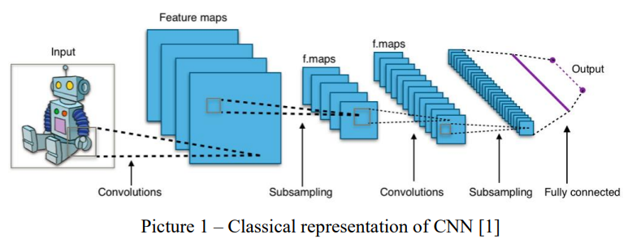 

## Data of this project and its feature

In the project initially decided to utilize the Landmark dataset, properties of which have not been given the possibility to manipulate over it. The size of the database was huge(105.52GB) and the computational capacities of the PC are not so powerful to deal with such an amount of data. Additionally, other problems were raised during the planning of the project. So, at that point we decided to switch to plan B, considering the initial goal – image classification using one of the models available for CNN.   It was decided to find a dataset that is computationally possible to work with and doesn’t cause out-of-memory errors. Was found dataset called “Flower color images” [2], which is memory satisfiable (80.07MB). The dataset consists of 210 images with a fixed size (128x128x3) with different types of flowering plants. All photos are in PNG format. On top of that, the author has already provided additional information – a file with labels in the file format CSV, which was a hint for dealing with data for CNN in further computations. There are 10 types of flowers in the dataset.  

It is clearly seen that classes of images are distributed not so smoothly, and they slightly fluctuate. However, it is not so critical fluctuation. In general, data is well-formed and is prepared for manipulations: converting data to tensors and targets, normalization, separation of the data to train, test and validation sets and further NN training using those sets, saving the best model and final analysis of results, etc.  

## Theoretical part
Nowadays Machines can easily recognize and distinguish different objects. This ability opens a broad spectrum of possible applications of this feature. Classification of images is quite a broad topic, which cannot be described in a few sentences, but to be a brief process of searching good literature can take a quite long time. The biggest part of the relevant literature for the project was taken from one of the most well-known hubs of ML and DL: TensorFlow, Kaggle, W3School, NumPy, Scikit-Learn, Pandas, etc. We can find multiple different implementation algorithms, which can be used.  

Nevertheless, for the purpose of the project, it was chosen two classical convolution models called – sequential models. Multiple models consist of layers – functions, which can be used repeatedly and have learnable parameters. This model is available in Keras. A sequential model is appropriate for a plain stack of layers where each layer has exactly one input tensor and one output tensor.  

Moreover, in a sequential model, you can define your own model like nested layers of Keras, which helps to have more control over the layers. Keras models have additional features that make it easier for them to learn, evaluate, load, save, and even learn on multiple machines.  

Additionally, due to the properties of the sequential model, it groups layers into an object with training and inference features. We have tried to visualize the model using embedded tools, but something went wrong during the installation phase, nevertheless, the layers, the output shapes, etc. can be seen in model.summary() string (picture 3).  

In the beginning, the task was to understand what tools and available libraries were appropriate to use. It depends on the model, which has been already picked. In the case of this project, images are going to be interpreted in tensors and stored in an h5 format file with corresponding labels to make it more suitable to work with this model.  

### Oleksandr’s model:

In order to train a model I have used a bunch of layers which are organized in the following improved sequence (Picture 3).  

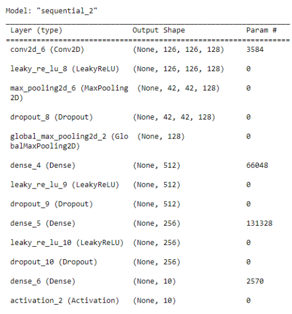  
<h4 align="center"> Picture 3. Created layers </h4>  

The key features of this algorithm are usage:  
* Convolutional 2D dimensions – Conv2D is a technique that is used for image layers and creates a core of convolution, which is folded to the input of the layer to produce an output tensor (picture 4). As this layer is input one input_shape should be set (this is the x_train shape);
* Activation layers called – LeakyRely or Softmax;
* MaxPooling2D is a sampling layer. The aim is to reduce the sample of the input representation (image, output matrix of the hidden layer, etc.). By reducing its dimension and making assumptions about the assumptions about properties contained in the selected subregions. It works by selecting a maximum value from the pool size_sub sample;
* Dropout – thinning layer to solve network overdrawing problem;
* MaxPooling2D/GlobalMaxPooling2D – pooling, in general, is basically downscaling the image obtained from the previous layer. In the first case, you take a maximum from the small region out of the ”pool” and in the second case you take the max from the whole “pool” (Picture 5);
* Dense - fully connected layer;
* ImageDataGenerator - generate batches of tensor image data with real-time data augmentation.

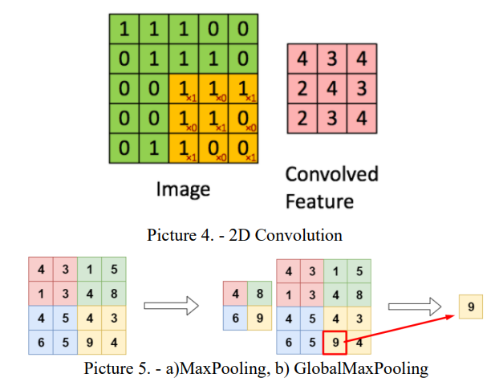  

The next step after the creation of the model Training phase is applied. To save the best model and additionally to reduce the learning rate dynamically – callbacks were used first. We were using an additional feature called ImageDataGenerator from the Keras package. This is one of the possibilities to increase the accuracy of the output by augmenting the data. ImageDataGenerator is a gem because it lets to augment images in real-time and build more accurate machine-learning models faster. The most frequently used augmentation data techniques are padding, random rotation, vertical and horizontal flipping, cropping, zooming, etc.  

With this, the NN will be learned with additional augmented data through additional epochs, because the amount of the images from where NN can extract features is low. In order to find the best way of dealing with accuracy and losses, experimentally were changed some values inside the model (picture 6) and the appliance of augmentation is also shown below (pictures 7 and 8).  

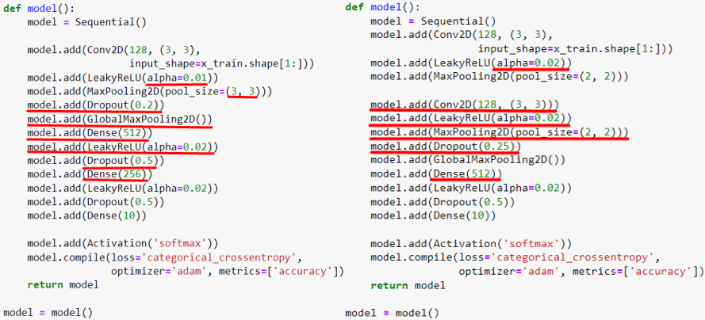  
<h4 align="center"> Picture 6. Comparison of the report (a) and presentation models (b) </h4>  

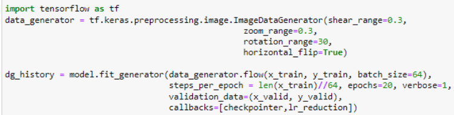  
<h4 align="center"> Picture 7. Augmentation </h4>  

The next stage should be the appliance of different approaches for the evaluation of achieved results. After training performance, the final part of the algorithm is the evaluation of the practical classification of images out of the test set.  

Dealing with the chosen task and searching for a useful model and efficient algorithm is one of the key aspects to making a good project, as well as sticking with the hypothesis is also a relevant task. From the first sign, it can be said that whole machine learning image classification techniques are suitable with a hypothesis and there is no use to count and describe all of them in this paper. It can be said concretely, chosen CNN algorithm is appropriate for the given hypothesis because it satisfies the main request classification of features of the images. The proof will be given in further sections.  

## Hyperparameters
Hyperparameters are parameters whose values control the learning process and determine the values of model parameters that a learning algorithm ends up learning. The prefix ‘hyper_’ suggests that they are ‘top-level’ parameters that control the learning process and the model parameters that result from it.  

In the project, there are several hyperparameters:  
- Train-test-validation split ratio. One of the key hyperparameters which, de facto, determines the ability of ML algorithm to be learned, tested, and processed in the future, in general;
- Choice of the optimization algorithm. Adam is one of the best gradient descent. Adam is a replacement optimization algorithm for stochastic gradient descent for training deep learning models. Adam combines the best properties of the AdaGrad and RMSProp algorithms to provide an optimization algorithm that can handle sparse gradients on noisy problems;
- Choice of Activation algorithm (e.g. LeakyRelu, Softmax, Relu). It defines how the weighted sum of the inputs is transformed into an output from a node(s) in a layer of the network;
- Setting of the threshold for Activation functions with the goal to prevent reaching a dead end;
- Loss function. A loss function is one of the two arguments required to compile a Keras model;
- Dropout rate – prevents overfitting;
- Number of hidden layers – defines the general ability of NN to learn;
- Filter size in convolution layers – defines how the filter is going to extract the feature;
- Pooling size – is used to reduce the dimensions of the feature maps;
- Batch size – number of training examples utilized in one iteration.

  ## Implementation
After making a general plan for the project life cycle, the implementation step comes into play. To implement the project, I used Python language and a Jupyter Notebook environment. It was one of the requirements. For working and successful implementation first task is the initialization of all necessary libraries:  

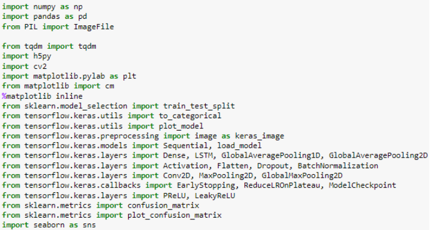  
<h4 align="center"> Picture 8. Imported packages and libraries </h4>  

Preprocessing data is an essential step before building a Deep Learning model. When creating a deep learning project, it is not always that we come across clean and well-formatted data. Therefore, while doing any operation with the data, it is mandatory to clean it and put it in a formatted way. Data preprocessing is the process of preparing the raw data and making it suitable for a machine or deep learning model and it is also the first and crucial step while creating a model.   Then, to process the data, images need to be converted into the array and then into tensors.  

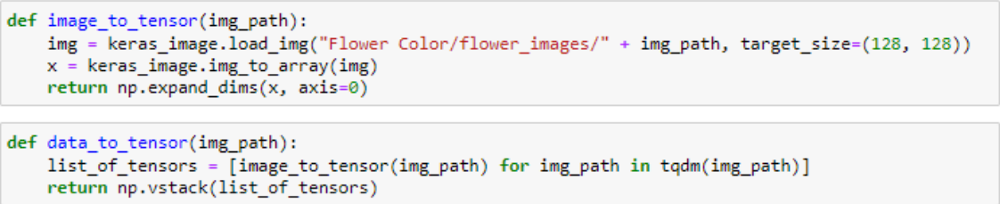  
<h4 align="center"> Picture 9 </h4>  

The next step is to load the data and store it csv format:  

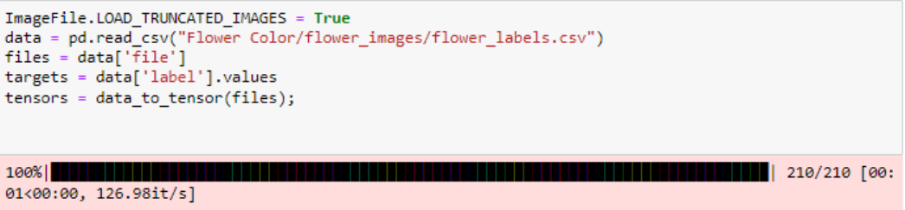  
<h4 align="center"> Picture 10 </h4>  

Additionally, it would be nice to visualize the distribution of the data building a plot:  

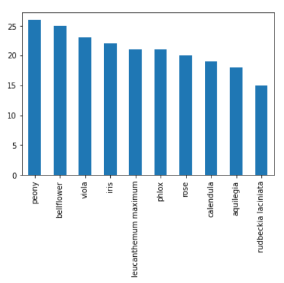  
<h4 align="center"> Picture 11 </h4>  

The description of the whole implementation will take up a lot of space in this report. The whole algorithm with explanations can be found in the attachments. However, I would like to indicate the main features of this project.  

PNG format stores channel values as uint8, in order to normalize values, it is needed to convert it to float32 between 0 and 1. And after such a procedure it is necessary to encode the label values. To do this in a brilliant way one-hot encoding is used. This type of encoding simply “produces one feature per category, each binary.” This data now can be split into training, validation, and testing sets and fed into the NN for prediction using classification (picture 12).  

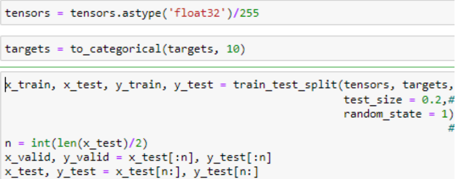  
<h4 align="center"> Picture 12 </h4>  

## Oleksandr’s model execution and evaluation
The main feature which was mentioned earlier in this project is its model which was picked up. It gives the opportunity to change a number of layers, suiting it as you wish. So, the layers which I found working are presented already in picture 3.  

To learn a lot about the performance of NN over time during training Keras has a powerful library called history callback. It records the training matrix for each epoch. Measurements include losses, accuracy, validation accuracy and validation losses (picture 1).  

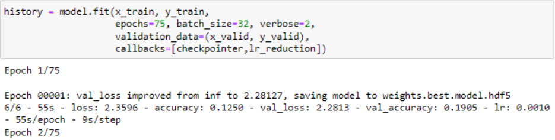  
<h4 align="center"> Picture 13. Performance of NN </h4>  

As was mentioned in the presentation part, with the purpose of improving the classification of NN, the model was trained with additional image generation functionality available in Keras, which helped a lot. The feature of this method is it not only makes the model robust but also will save up on the overhead memory, which was one of the main problems! With this in mind, the model fits with this data.  

### Evaluation

After making all the necessary steps to set up a model and executing a test, the evaluation part comes into play. Evaluation functions are essential for quantifying the quality of a system’s classification. To do this we measure the newly trained performance on a new independent set, but firstly we use evaluation functions implemented into libraries in order to present and the visualize results of the evaluation. The main and most interesting parameter for image classification is image accuracy and losses (Picture 14).  

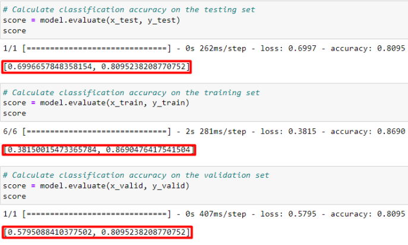  
<h4 align="center"> Picture 14. Evaluation of NN </h4>  

From the evaluations, it is clearly seen that the accuracy percentage of training (2) and validation (3) sets are high, which means that the NN is able to learn and not overfit, which is great! This approach is successful for learning. After building a model, it would be nice to show model accuracy and model loss respectively in picture 15.  

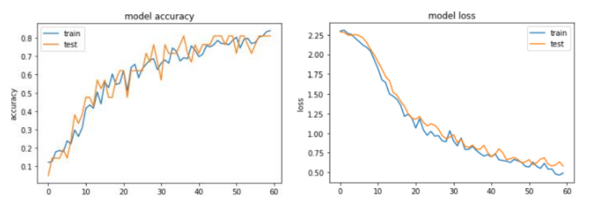  
<h4 align="center"> Picture 15. Model accuracy and loss </h4>  

From graphics, it is clearly seen the ability to learn and perform is trained through epochs. Achieved evaluation matrics are proofs of it. However, if to have a look at the testing set, it is seen that the model achieved a higher result such as in our presentation part, which means that it has improved its performance from 75 % to 81 % of accuracy thanks to data augmentation. Generally, from 16 randomly picked pictures, NN managed to classify correctly 14 out of 16 pictures, which is a very good result.  

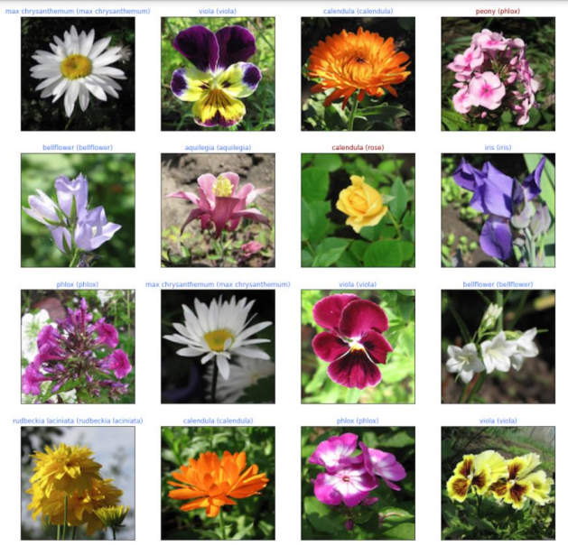  
<h4 align="center"> Picture 16. Predictions </h4>  

Additionally, it is possible to show the quality of the performance through a confusion matrix. The confusion matrix is used to describe the performance of a classification model on a set of test data for which the true values are known.  

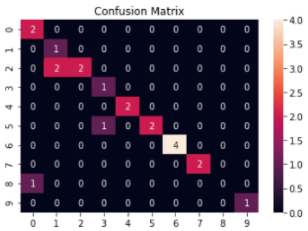  
<h4 align="center"> Picture 17. Confusion matrix </h4>  

This specific table allows visualization of the performance of the algorithm. On the x-axis are stated predicted values and on the y-axis are located original values. From the confusion matrix, it is clearly seen that almost whole values are predicted correctly except for some small errors.  

## Palina’s model execution and evaluation

As was discussed during the presentation of the model in order to achieve a better performance of neural networks some additional techniques can be introduced:  

* Setting up the augmentation;
* Increasing the number of layers;
* Additional images in the database;
* The introduction of pre-trained models, etc.
  
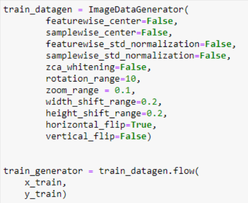  
<h4 align="center"> Picture 18. Augmentation </h4>  

The image augmentation was added to the code implementation as it is shown in Picture 18 and was executed only to the training set. With the help of such changes as zooming, rotating, and flipping of the pictures the model shows a better output in terms of accuracy of the test and validation sets.  

Additionally, I have fixed the issues with overfitting the model by reducing the number of layers. In particular, the sequential model now consists of three Convolutional layers, with filters equal to 2056, 1028 and 512 respectively. MaxPooling and Dropout I remained the same.  

As a result, we can observe the above-mentioned neural network model in the block representation:  

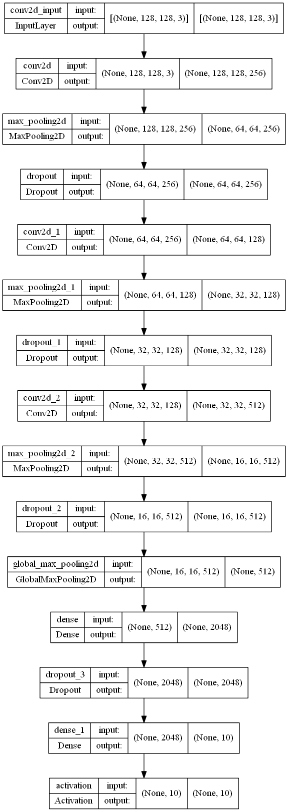  
<h4 align="center"> Picture 19. Palina’s model </h4>  

Previous results: training accuracy – 0.94:  
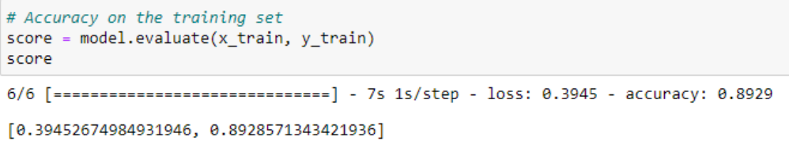  

Previous results: validation accuracy – 0.71:  
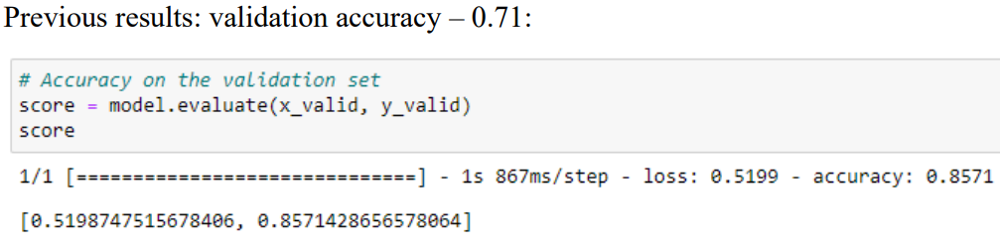  

Previous results: testing accuracy – 0.71:  
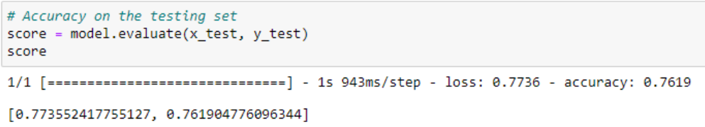  

According to the pictures above, the model did not represent the expected output and required further developments and observations. It is clearly seen that only validation and testing sets increased in accuracy whereas the training set dropped by several points. Probably, we faced the given issues due to the small number of images and as a result, the neural network did not train enough.  

Nevertheless, during the training of my model, the achieved maximum training accuracy was equal to 0.90 which almost reached the initial goal. We can see in Picture 20 the evaluation of the accuracy and loss function of train and test sets.  

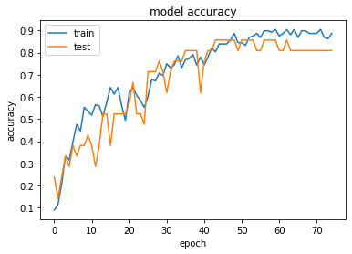 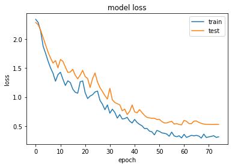  
<h4 align="center"> Picture 20. Accuracy and loss function charts </h4>  

Another way to illustrate the obtained result is given below (Picture 21) where we can observe the predictions of flowers where the real and predicted model solutions are given. In comparison with the initial model, the number of correctly predicted flowers stayed the same (12 out of 16 correct answers).  

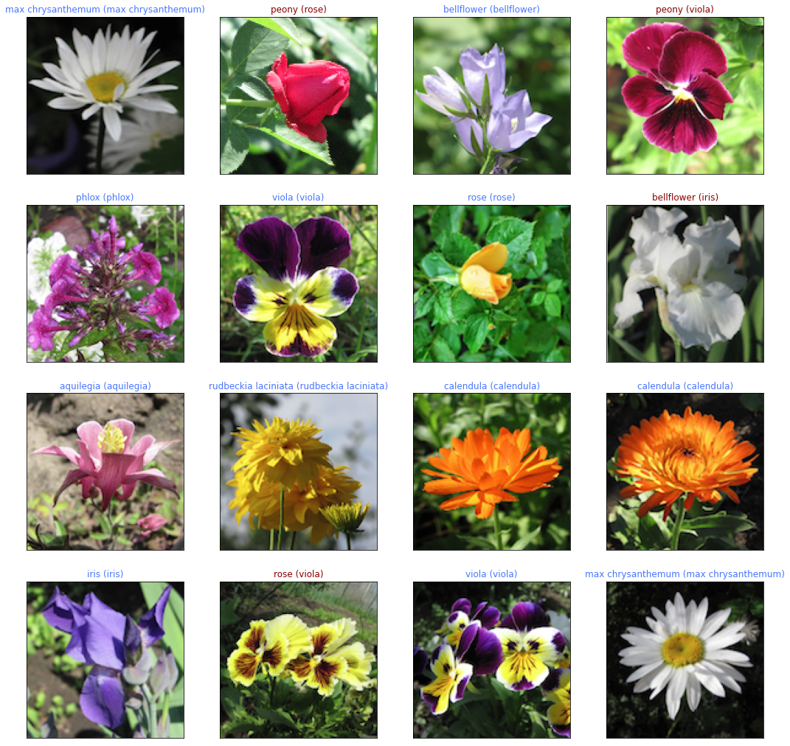  
<h4 align="center"> Picture 21. Model prediction on test set </h4>  

Below we can see a confusion matrix which is a summarized table that shows the number of correct and incorrect predictions (Picture 22). I would like to mention that I tried a lot of variations both with the given model and even introduced a pre-trained model ResNet50, however, in both cases I obtained a worse result than the initial one. Even augmentation slightly raised the accuracy of the model, therefore, I can conclude that the given model is far from giving the accurate and expected solution.  

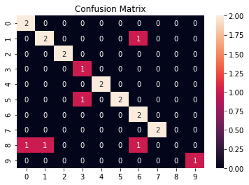  
<h4 align="center"> Picture 22. Confusion matrix </h4>  

## Conclusion
Neuronal Networks are a newly developing area, which only started to actively develop and find its place in the up-to-date world. The aim of this project was to show that classification is very demandable and can propose wide and comprehensive possibilities for almost every critical and casual field of the world, where classification will be handy and needed.  

Regarding the overall evaluation of the project, it can be said that, basically, the purposes of the learning task and hypothesis are fulfilled, however, there exist algorithms, which can perform the task better in terms of quantity of epochs and more optimized training NN. As a recommendation for future steps, we would recommend evaluating final performance and taking care of loss results. Perhaps, we would find a way to increase the computing powers and increased the size of the dataset with the final goal to find a way for more precise classification. Additionally, there are already implemented pretrained models which are able to classify objects with a 95-97% accuracy level.   

To conclude, the search for the best way to classify the data is very individual and there is no universal way to deal with all ML classification problems as a given template.  

## References 

1. [Named Link](https://towardsdatascience.com/modeling-visual-neurons-with-convolutionalneural-networks-e9c01ddfdfa7)
2. [Named Link](https://www.kaggle.com/olgabelitskaya/flower-color-images)
   
