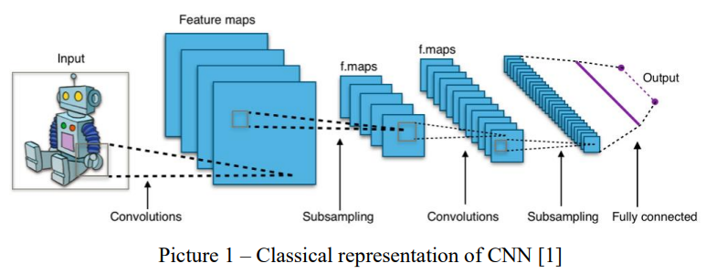

# Flower-Recognition
Machine Learning project

Group members:
Pidlubnyi Oleksandr 12120137
Palina Dubatouka 12116714 

## Data analysis
First, the desired project is an implementation of one of the key conceptions of
Deep Learning and Machine learning, in general. Convolution Neural Networks
(CNN) found their concrete place in the modern world. CNN is designed to work with
image data and they are based on the shared-weight architecture of the convolution
kernels or filters that slide along input features and provide translation equivariant
responses known as feature maps. The interesting feature of CNN is the fact that they
are opaque, which means they are poor at the explanation of the reason for its decision
made. However, it is still possible to indicate the key features, which were taken into
consideration in order to have an efficiently working NN:

#Architecture
CNN consists of input, hidden and output layers. Each layer
convolves the inputs and produces output. Variations of hidden layers represent
convolutions. This includes a layer which performs a dot product of the convolution
kernel with the input matrix of the layer. So, during sliding of convolution kernel
through the input matrix for the layer, this operation generates a feature map,
which is an input to the next layer. Choosing of right configuration may
significantly increase the affirmativeness of performance.  
#Pooling layers
It reduces the dimensions of data. It combines the outputs of neuron
clusters at one layer into a single neuron in the next layer. As we have feature maps
here, the global pooling layers are going to be pondered over. Precisely, max
pooling utilizes the max value of each local cluster in the feature map.  
#3D volumes of neurons
The layers have a feature to be arranged in 3 dimensions:
width, depth, and height. 
#Shared weights and feature map
Filters are replicated along the entire visual field.
They share the same weights and biases forming a feature map.  

  

